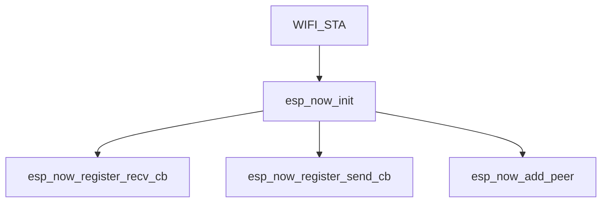

# Задание 5.1: Обмен данными между ESP32 через ESP-NOW

## Цель: Научиться передавать данные между двумя ESP32 с использованием протокола ESP-NOW без Wi-Fi роутера.

# Теория

---

## 1. Протокол ESP-NOW

<blockquote>

- Технология для прямого обмена данными между устройствами
- **Не требует Wi-Fi роутера**
- Работает на `2.4 ГГц`
- Максимальная скорость: **1 Мбит/с**
- Максимальный размер пакета: `250` байт
- Зона действия **~100 м** на открытом пространстве

</blockquote>

## 2. MAC-адрес

<blockquote>

- **MAC** - _Media Access Control_
- Уникальный идентификатор сетевого интерфейса
- Формат: 6 байт в HEX `XX:XX:XX:XX:XX:XX`
- Как узнать MAC ESP32:
    1) Во время выполнения программы: `WiFi.macAddress() -> String`
    2) Во время загрузки на плату: `MAC: XX:XX:XX:XX:XX:XX`

</blockquote>

## 3. Структуры данных

<blockquote>

```cpp
struct [[gnu::packed]] MyPacket {
    // Определение полей пакета
};
```

- Определить пакет как структуру - самый универсальный способ
- Атрибут `[[gnu::packed]]` гарантирует **минимальный размер** структуры **(без выравнивания)**

</blockquote>

## 4. Функции обратного вызова (Callbacks)

<blockquote>

### На приём данных

```c
void onReceive(
    esp_now_recv_info_t *info,  // Указатель на структуру описывающую информацию
    const uint8_t *data,        // Указатель на Си-массив содержащий данные пакета
    int size                    // Размер данных (Байт)
) -> void
```

<details>

<summary><strong>Определение</strong> <code>esp_now_recv_info_t</code> </summary>

```c
// Основная структура информации о полученном пакете
typedef struct {

uint8_t *src_addr;              // MAC-адрес отправителя
uint8_t *des_addr;              // MAC-адрес получателя
wifi_pkt_rx_ctrl_t *rx_ctrl;    // Метаданные пакета
int rssi;                       // Уровень сигнала (RSSI)

} esp_now_recv_info_t;
```

---

<details>

<summary><strong>Определение</strong> <code>wifi_pkt_rx_ctrl_t</code> </summary>

```c
// Структура с метаданными пакета
typedef struct {

signed rssi: 8;                 // Уровень сигнала в dBm (-127 до 0)
unsigned rate: 5;               // Скорость передачи (0-31)
unsigned : 1;                   // Зарезервировано (выравнивание)
unsigned sig_mode: 2;           // Режим сигнала (0: неуказан, 1: 11b, 2: 11g, 3: 11n)
unsigned : 16;                  // Зарезервировано
unsigned mcs: 7;                // Индекс MCS для 11n (0-76)
unsigned cwb: 1;                // Ширина канала (0: 20MHz, 1: 40MHz)
unsigned : 16;                  // Зарезервировано
unsigned smoothing: 1;          // Флаг сглаживания
unsigned not_sounding: 1;       // Флаг "не звуковой"
unsigned : 1;                   // Зарезервировано
unsigned aggregation: 1;        // Флаг агрегации
unsigned stbc: 2;               // Пространственно-временное кодирование
unsigned fec_coding: 1;         // Кодирование FEC
unsigned sgi: 1;                // Короткий защитный интервал
signed noise_floor: 8;          // Уровень шума
uint8_t ant;                    // Номер антенны
uint32_t sig_len;               // Длина сигнала
uint32_t rx_state;              // Состояние приема

} wifi_pkt_rx_ctrl_t;
```

</details>

</details>

---

<details>

<summary><strong>Устаревшее API</strong><code>ESP-IDF < 2.0</code></summary>

```c
void onReceive(
    const uint8_t *mac,         // Указатель на Си-массив содержащий MAC адрес
    const uint8_t *data,        // Указатель на Си-массив содержащий данные пакета
    int size                    // Размер данных (Байт)
) -> void
```

</details>

---

### На доставку данных

```c
void onSend(
    const uint8_t *mac,             // Указатель на Си-массив содержащий MAC адрес
    esp_now_send_status_t status    // Перечисление (enum) статуса доставки
) -> void
```

<details>

<summary><strong>Определение</strong> <code>esp_now_send_status_t</code> </summary>

```c
typedef enum {
    ESP_NOW_SEND_SUCCESS = 0,       // Успешная отправка
    ESP_NOW_SEND_FAIL,              // Неудачная отправка
} esp_now_send_status_t;
```

</details>

</blockquote>

## 5. Инициализация ESP-NOW

<blockquote>



</blockquote>

## 6. Создание пира

<blockquote>

**Пир** (Peer) - это устройство, с которым необходимо установить связь для обмена данными

---

Необходимо создать экземпляр структуры `esp_now_peer_info_t` для настройки пира

Задать в нём поле `esp_now_peer_info_t::peer_addr` значением **MAC** адреса.

<details open>
<summary><strong>Способ <code>C++</code> </strong></summary>

```cpp
// Определяем MAC адрес пира
std::array<uint8_t, 6> target_mac = { 0x12, 0x34, 0x56, 0x78, 0x9A, 0xBC };

// Создаём экземпляр настроек пира
esp_now_peer_info_t peer = {};

// Копируем содержимое target_mac в peer.peer_addr
std::copy(target_mac.begin(), target_mac.end(), peer.peer_addr);
```

</details>

<details>
<summary><strong>Способ <code>C</code> </strong></summary>

```c
// Определяем MAC адрес пира
uint8_t target_mac[] = { 0x12, 0x34, 0x56, 0x78, 0x9A, 0xBC };

// Создаём экземпляр настроек пира
esp_now_peer_info_t peer = { 0 };

// Копируем содержимое target_mac в peer.peer_addr
memcpy(peer.peer_addr, target_mac, sizeof(peer.peer_addr));
```

</details>

---

**Broadcast** пир (широковещательный)

- Имеет адрес `FF-FF-FF-FF-FF-FF`
- Не должен иметь шифрования (`esp_now_peer_info_t::encrypt = false`)
- Действует в рамках одного канала (`esp_now_peer_info_t::channel`)

---

<details>

<summary><strong>Определение</strong> <code>esp_now_peer_info_t</code> </summary>

```c
typedef struct esp_now_peer_info_t {
    /**
     * MAC-адрес пира ESPNOW, который также является:
     * - MAC-адресом станции (STA) ИЛИ
     * - MAC-адресом точки доступа (SoftAP)
     */
    uint8_t peer_addr[ESP_NOW_ETH_ALEN];
    
    /**
     * Локальный мастер-ключ (LMK) пира, используемый для:
     * - Шифрования ESPNOW-данных
     * - Длина ключа: ESP_NOW_KEY_LEN (16 байт)
     */
    uint8_t lmk[ESP_NOW_KEY_LEN];
    
    /**
     * Wi-Fi канал для связи с пиром:
     * - 0: Использовать текущий канал STA/SoftAP
     * - 1-14: Явное указание канала
     * - Важно: Должен совпадать с каналом STA/SoftAP!
     */
    uint8_t channel;
    
    /**
     * Сетевой интерфейс для ESPNOW-связи:
     * - WIFI_IF_STA: Интерфейс станции
     * - WIFI_IF_AP: Интерфейс точки доступа
     */
    wifi_interface_t ifidx;
    
    /**
     * Флаг шифрования данных:
     * - true: Шифровать данные с помощью LMK
     * - false: Отправлять открытые данные
     */
    bool encrypt;
    
    /**
     * Приватные данные пира:
     * - Пользовательский указатель для хранения контекста
     * - Не используется ESPNOW напрямую
     */
    void *priv;
} esp_now_peer_info_t;
```

</details>

</blockquote>

## 7. Добавление пира

<blockquote>

**Добавление пира в список пиров выполняется с помощью данной функции ESP NOW API**:

```c
esp_now_add_peer(
    const esp_now_peer_info_t *peer // Сведения о пире
) -> esp_err_t                      // Результат выполнения
```

---


<details>

<summary><strong>Варианты</strong> <code>esp_err_t</code></summary>

<div align="center">

| Тип результата            | Значение                       |
|---------------------------|--------------------------------|
| `ESP_OK`                  | Успешно добавлен               |
| `ESP_ERR_ESPNOW_NOT_INIT` | ESP NOW не был инициализирован |
| `ESP_ERR_ESPNOW_ARG`      | Неверный аргумент              |
| `ESP_ERR_ESPNOW_FULL`     | Список пиров полон             |
| `ESP_ERR_ESPNOW_NO_MEM`   | Не хватает памяти              |
| `ESP_ERR_ESPNOW_EXIST`    | Пир уже добавлен               |

</div>

</details>


</blockquote>

## 8. Отправка данных

<blockquote>

**Отправка данных осуществляется через функцию `esp_now_send`**

```c
esp_now_send(
    const uint8_t *mac,     // Адрес получателя
    const uint8_t *data,    // Данные
    int len                 // Размер пакета ( <= 250)
) -> esp_err_t              // Результат отправки
```

---

Примеры отправки пакета данных `MyPacket`
* `MyPacket` - это пользовательская структура _(допустим, что определили в скетче)_


<details open>
<summary><strong>способ <code>C++</code></strong></summary>

```cpp
MyPacket packet{ /* Заполняем пакет данными */ };

// Отправляем пакет и получаем статус отправки в очередь сообщений
esp_err_t result = esp_now_send(
    target_mac.data(),                      // Получаем сырой указатель на МАС адрес
    reinterpret_cast<uint8_t *>(&packet),   // Реинтерпретируем указатель данных нашего пакета как сырой указатель 
    sizeof(MyPacket)                        // Автоматически определяем размер пакета размером структуры
);
```

</details>

<details>
<summary><strong>способ <code>C</code></strong></summary>

```c
MyPacket packet = { /* Заполняем пакет данными */ };

// Отправляем пакет и получаем статус отправки в очередь сообщений
esp_err_t result = esp_now_send(
    target_mac,                             // Передаём МАС адрес (Он и есть Си-Массив)
    (uint8_t *)&packet,                     // Преобразуем указатель данных
    sizeof(MyPacket)                        // Автоматически определяем размер пакета размером структуры
);
```

</details>

---

После вызова данной функции **сообщение будет передано в очередь и будет своевременно отправлено** _(о чём можно будет узнать через **callback** на отправку)_

<details>

<summary><strong>Варианты</strong> <code>esp_err_t</code></summary>

<div align="center">

| Тип результата             | Значение                                        |
|----------------------------|-------------------------------------------------|
| `ESP_OK`                   | Успешно добавлен                                |
| `ESP_ERR_ESPNOW_NOT_INIT`  | ESP NOW не был инициализирован                  |
| `ESP_ERR_ESPNOW_ARG`       | Неверный аргумент                               |
| `ESP_ERR_ESPNOW_INTERNAL`  | Внутренняя ошибка                               |
| `ESP_ERR_ESPNOW_NO_MEM`    | Не хватает памяти  (Можно попытаться потом)     |
| `ESP_ERR_ESPNOW_NOT_FOUND` | Пир не найден (В списке пиров)                  |
| `ESP_ERR_ESPNOW_IF`        | Текущий интерфейс WiFi не определяет данный пир |

</div>

</details>

</blockquote>


##              

<blockquote>

</blockquote>
