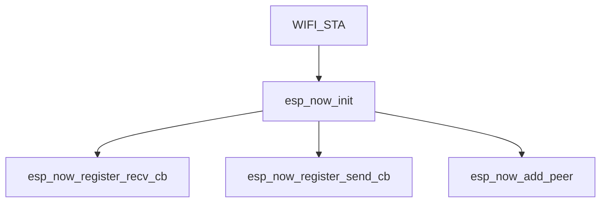

# Задание 5.1: Обмен данными между ESP32 через ESP-NOW

## Цель: Научиться передавать данные между двумя ESP32 с использованием протокола ESP-NOW без Wi-Fi роутера.

# Теория

---

## 1. Протокол ESP-NOW

<blockquote>

- Технология для прямого обмена данными между устройствами
- **Не требует Wi-Fi роутера**
- Работает на `2.4 ГГц`
- Максимальная скорость: **1 Мбит/с**
- Максимальный размер пакета: `250` байт
- Зона действия **~100 м** на открытом пространстве

</blockquote>

## 2. MAC-адрес

<blockquote>

- **MAC** - _Media Access Control_
- Уникальный идентификатор сетевого интерфейса
- Формат: 6 байт в HEX `XX:XX:XX:XX:XX:XX`
- Как узнать MAC ESP32:
    1) Во время выполнения программы: `WiFi.macAddress() -> String`
    2) Во время загрузки на плату: `MAC: XX:XX:XX:XX:XX:XX`

</blockquote>

## 3. Инициализация ESP-NOW

<blockquote>

<details open>
<summary><strong>Диаграмма вызовов API</strong></summary>



</details>

---

1. **Включить режим `STA` (Режим станции)**

    ```cpp
    WiFi.mode(WIFI_STA);
    ```

2. **Инициализировать протокол `ESP NOW`**

    ```c
    esp_err_t result = esp_now_init();
    ```

    <details>

    <summary><strong>Определение</strong> <code>esp_now_init</code></summary>
    Сигнатура:

    ```c
    esp_now_init() -> esp_err_t;
    ```

    <details>
    <summary><strong>Варианты</strong> <code>esp_err_t</code></summary>

    - `ESP_OK` - Успешно добавлен
    - `ESP_ERR_ESPNOW_INTERNAL` - Внутренняя ошибка API `ESP NOW`

    </details>

    </details>

3. **Зарегистрировать обработчики приёма и отправки сообщений**

   <details>
   <summary><strong>Определение</strong> <code>esp_now_register_recv_cb</code> и <code>esp_now_register_send_cb</code></summary>

   ```c
    esp_now_register_recv_cb(
        esp_now_recv_cb_t cb    // Обработчик
    ) -> esp_err_t              // Результат регистрации
   ```

   ```c
    esp_now_register_send_cb(
        esp_now_send_cb_t cb    // Обработчик
    ) -> esp_err_t              // Результат регистрации
   ```

   <details>
    <summary><strong>Варианты</strong> <code>esp_err_t</code></summary>

    - `ESP_OK` - Успешно добавлен
    - `ESP_ERR_ESPNOW_NOT_INIT` - `ESP NOW` не был инициализирован
    - `ESP_ERR_ESPNOW_INTERNAL` - Внутренняя ошибка API `ESP NOW`

   </details>

   </details>

</blockquote>

## 4. Функции обратного вызова (Callbacks)

<blockquote>

### На приём данных

```c
void onReceive(
    esp_now_recv_info_t *info,  // Указатель на структуру описывающую информацию
    const uint8_t *data,        // Указатель на Си-массив содержащий данные пакета
    int size                    // Размер данных (Байт)
) -> void
```

<details>

<summary><strong>Определение</strong> <code>esp_now_recv_info_t</code> </summary>

```c
// Основная структура информации о полученном пакете
typedef struct {

uint8_t *src_addr;              // MAC-адрес отправителя
uint8_t *des_addr;              // MAC-адрес получателя
wifi_pkt_rx_ctrl_t *rx_ctrl;    // Метаданные пакета
int rssi;                       // Уровень сигнала (RSSI)

} esp_now_recv_info_t;
```

---

<details>

<summary><strong>Определение</strong> <code>wifi_pkt_rx_ctrl_t</code> </summary>

```c
// Структура с метаданными пакета
typedef struct {

signed rssi: 8;                 // Уровень сигнала в dBm (-127 до 0)
unsigned rate: 5;               // Скорость передачи (0-31)
unsigned : 1;                   // Зарезервировано (выравнивание)
unsigned sig_mode: 2;           // Режим сигнала (0: неуказан, 1: 11b, 2: 11g, 3: 11n)
unsigned : 16;                  // Зарезервировано
unsigned mcs: 7;                // Индекс MCS для 11n (0-76)
unsigned cwb: 1;                // Ширина канала (0: 20MHz, 1: 40MHz)
unsigned : 16;                  // Зарезервировано
unsigned smoothing: 1;          // Флаг сглаживания
unsigned not_sounding: 1;       // Флаг "не звуковой"
unsigned : 1;                   // Зарезервировано
unsigned aggregation: 1;        // Флаг агрегации
unsigned stbc: 2;               // Пространственно-временное кодирование
unsigned fec_coding: 1;         // Кодирование FEC
unsigned sgi: 1;                // Короткий защитный интервал
signed noise_floor: 8;          // Уровень шума
uint8_t ant;                    // Номер антенны
uint32_t sig_len;               // Длина сигнала
uint32_t rx_state;              // Состояние приема

} wifi_pkt_rx_ctrl_t;
```

</details>

</details>

---

<details>

<summary><strong>Устаревшее API</strong> <code>ESP-IDF < 2.0</code></summary>

```c
void onReceive(
    const uint8_t *mac,         // Указатель на Си-массив содержащий MAC адрес
    const uint8_t *data,        // Указатель на Си-массив содержащий данные пакета
    int size                    // Размер данных (Байт)
) -> void
```

</details>

---

### На доставку данных

```c
void onSend(
    const uint8_t *mac,             // Указатель на Си-массив содержащий MAC адрес
    esp_now_send_status_t status    // Перечисление (enum) статуса доставки
) -> void
```

<details>

<summary><strong>Определение</strong> <code>esp_now_send_status_t</code> </summary>

```c
typedef enum {
    ESP_NOW_SEND_SUCCESS = 0,       // Успешная отправка
    ESP_NOW_SEND_FAIL,              // Неудачная отправка
} esp_now_send_status_t;
```

</details>

</blockquote>

## 5. Создание пира

<blockquote>

**Пир** (Peer) - это устройство, с которым необходимо установить связь для обмена данными

---

Необходимо создать экземпляр структуры `esp_now_peer_info_t` для настройки пира

Задать в нём поле `esp_now_peer_info_t::peer_addr` значением **MAC** адреса.

<details open>
<summary><strong>Способ <code>C++</code> </strong></summary>

```cpp
// Определяем MAC адрес пира
std::array<uint8_t, 6> broadcast_address = { 0x12, 0x34, 0x56, 0x78, 0x9A, 0xBC };

// Создаём экземпляр настроек пира
esp_now_peer_info_t peer = {};

// Копируем содержимое broadcast_address в peer.peer_addr
std::copy(broadcast_address.begin(), broadcast_address.end(), peer.peer_addr);
```

</details>

<details>
<summary><strong>Способ <code>C</code> </strong></summary>

```c
// Определяем MAC адрес пира
uint8_t broadcast_address[] = { 0x12, 0x34, 0x56, 0x78, 0x9A, 0xBC };

// Создаём экземпляр настроек пира
esp_now_peer_info_t peer = { 0 };

// Копируем содержимое broadcast_address в peer.peer_addr
memcpy(peer.peer_addr, broadcast_address, sizeof(peer.peer_addr));
```

</details>

---

**Broadcast** пир (широковещательный)

- Имеет адрес `FF-FF-FF-FF-FF-FF`
- Не должен иметь шифрования (`esp_now_peer_info_t::encrypt = false`)
- Действует в рамках одного канала (`esp_now_peer_info_t::channel`)
- При результате `ESP_OK` `esp_now_send` обработчик доставки примёт статус `esp_now_send_status_t::ESP_NOW_SEND_FAIL`

---

<details>

<summary><strong>Определение</strong> <code>esp_now_peer_info_t</code> </summary>

```c
typedef struct esp_now_peer_info_t {
    /**
     * MAC-адрес пира ESPNOW, который также является:
     * - MAC-адресом станции (STA) ИЛИ
     * - MAC-адресом точки доступа (SoftAP)
     */
    uint8_t peer_addr[ESP_NOW_ETH_ALEN];
    
    /**
     * Локальный мастер-ключ (LMK) пира, используемый для:
     * - Шифрования ESPNOW-данных
     * - Длина ключа: ESP_NOW_KEY_LEN (16 байт)
     */
    uint8_t lmk[ESP_NOW_KEY_LEN];
    
    /**
     * Wi-Fi канал для связи с пиром:
     * - 0: Использовать текущий канал STA/SoftAP
     * - 1-14: Явное указание канала
     * - Важно: Должен совпадать с каналом STA/SoftAP!
     */
    uint8_t channel;
    
    /**
     * Сетевой интерфейс для ESPNOW-связи:
     * - WIFI_IF_STA: Интерфейс станции
     * - WIFI_IF_AP: Интерфейс точки доступа
     */
    wifi_interface_t ifidx;
    
    /**
     * Флаг шифрования данных:
     * - true: Шифровать данные с помощью LMK
     * - false: Отправлять открытые данные
     */
    bool encrypt;
    
    /**
     * Приватные данные пира:
     * - Пользовательский указатель для хранения контекста
     * - Не используется ESPNOW напрямую
     */
    void *priv;
} esp_now_peer_info_t;
```

</details>

</blockquote>

## 6. Добавление пира

<blockquote>

**Добавление пира в список пиров выполняется с помощью данной функции ESP NOW API**:

```c
esp_now_add_peer(
    const esp_now_peer_info_t *peer // Сведения о пире
) -> esp_err_t                      // Результат выполнения
```

---


<details>

<summary><strong>Варианты</strong> <code>esp_err_t</code></summary>

<div align="center">

| Тип результата            | Значение                         |
|---------------------------|----------------------------------|
| `ESP_OK`                  | Успешно добавлен                 |
| `ESP_ERR_ESPNOW_NOT_INIT` | `ESP NOW` не был инициализирован |
| `ESP_ERR_ESPNOW_ARG`      | Неверный аргумент                |
| `ESP_ERR_ESPNOW_FULL`     | Список пиров полон               |
| `ESP_ERR_ESPNOW_NO_MEM`   | Не хватает памяти                |
| `ESP_ERR_ESPNOW_EXIST`    | Пир уже добавлен                 |

</div>

</details>


</blockquote>

## 7. Структуры данных

<blockquote>

```cpp
struct [[gnu::packed]] MyPacket {
    // Определение полей пакета
};
```

- Определить пакет как структуру - самый универсальный способ
- Атрибут `[[gnu::packed]]` гарантирует **минимальный размер** структуры **(без выравнивания)**

</blockquote>

## 8. Отправка данных

<blockquote>

**Отправка данных осуществляется через функцию `esp_now_send`**

```c
esp_now_send(
    const uint8_t *mac,     // Адрес получателя
    const uint8_t *data,    // Данные
    int len                 // Размер пакета ( <= 250)
) -> esp_err_t              // Результат отправки
```

---

Примеры отправки пакета данных `MyPacket`

* `MyPacket` - это пользовательская структура _(допустим, что определили в скетче)_

<details open>
<summary><strong>способ <code>C++</code></strong></summary>

```cpp
MyPacket packet{ /* Заполняем пакет данными */ };

// Отправляем пакет и получаем статус отправки в очередь сообщений
esp_err_t result = esp_now_send(
    // Получаем сырой указатель на МАС адрес
    broadcast_address.data(),                      
    // Реинтерпретируем указатель данных нашего пакета как сырой указатель 
    reinterpret_cast<uint8_t *>(&packet),   
    // Автоматически определяем размер пакета размером структуры
    sizeof(MyPacket)                        
);
```

</details>

<details>
<summary><strong>способ <code>C</code></strong></summary>

```c
MyPacket packet = { /* Заполняем пакет данными */ };

// Отправляем пакет и получаем статус отправки в очередь сообщений
esp_err_t result = esp_now_send(
    // Передаём МАС адрес (Он и есть Си-Массив)
    broadcast_address,                             
    // Преобразуем указатель данных
    (uint8_t *)&packet,                     
    // Автоматически определяем размер пакета размером структуры
    sizeof(MyPacket)                        
);
```

</details>

---

После вызова данной функции **сообщение будет передано в очередь и будет своевременно отправлено** _(о чём можно будет узнать через **callback** на отправку)_

<details>

<summary><strong>Варианты</strong> <code>esp_err_t</code></summary>

<div align="center">

| Тип результата             | Значение                                        |
|----------------------------|-------------------------------------------------|
| `ESP_OK`                   | Успешно добавлен                                |
| `ESP_ERR_ESPNOW_NOT_INIT`  | `ESP NOW` не был инициализирован                |
| `ESP_ERR_ESPNOW_ARG`       | Неверный аргумент                               |
| `ESP_ERR_ESPNOW_INTERNAL`  | Внутренняя ошибка                               |
| `ESP_ERR_ESPNOW_NO_MEM`    | Не хватает памяти  (Можно попытаться позже)     |
| `ESP_ERR_ESPNOW_NOT_FOUND` | Пир не найден (В списке пиров)                  |
| `ESP_ERR_ESPNOW_IF`        | Текущий интерфейс WiFi не определяет данный пир |

</div>

</details>

</blockquote>

## 9. Ограничения на типы данных при отправке по сети

<blockquote>

### По сети некорректно передавать:

<details>
<summary><strong>1. Динамические указатели</strong></summary>

```cpp
Foo *content = new Foo();

esp_now_send(mac, (uint8_t*)&content, sizeof(content));
//                          ^--- Передаём указатель на указатель
delete foo;
```

* Проблема: Передается **адрес в памяти**, а не данные

</details>


<details>
<summary><strong>2. Структуры с виртуальными методами</strong></summary>

```cpp
struct Device {
    virtual void update() {}  // Виртуальный метод
};
```

* Проблема: Содержит скрытый указатель vtable
* Решение: Использовать **POD**-структуры ()

</details>


<details>
<summary><strong>3. STL-контейнеры динамическим выделением памяти</strong></summary>

```cpp
std::vector<int> data = {1, 2, 3};

// data хранит данные в heap
```

* Проблема: Динамическое выделение памяти и автоматическое управление ею

</details>


<details>
<summary><strong>4. Сложные объекты с конструкторами</strong></summary>

```cpp
String str = "arduinoString data data data .......... data";  // Опасная передача!
```

* Проблема: Внутренняя буферизация и управление памятью

</details>


<details>
<summary><strong>5. Структуры с выравниванием (без packed) и архитектурно зависящими типами</strong></summary>

```cpp
struct Data {
    char c;     // 1 байт
    int i;      // 4 байта на ESP, но 2 байта на AVR
};              // Размер 8 байт (из-за выравнивания) на ESP, но 3 байта на AVR
```

* Проблема: Разное расположение данных на разных архитектурах
* Решение: Использовать атрибуты и типы фиксированного размера:

```cpp
struct [[gnu::packed]] Data {
    uint8_t c;  // 1 байт и unsigned (гарантируется поставщиком компилятора)
    int32_t i;  // 4 байта и signed (гарантируется поставщиком компилятора)
};              // Размер 1 + 4 байта (минимальный размер) из-за атрибута упаковки
```

</details>


<details>
<summary><strong>6. Файловые дескрипторы/ресурсы ОС</strong></summary>

```cpp
fs::File myFile = fs::FS.open("/spiffs/data.txt", "r");
```

* Проблема: Локальные идентификаторы системы
* Решение: Передавать только содержимое файлов

</details>


<details>
<summary><strong>7. Указатели на функции</strong></summary>

```cpp

void myFuncToDo_1( ... ) { /* ... */ }

auto fooToDo = &myFuncToDo_1;

```

* Проблема: Адреса функций не имеют смысла на другом устройстве
* Решение: Передавать ID команд

```cpp
enum class Command : uint8_t {
    TouchGrass  = 0,
    TouchWater,
    SayHello,
    SayBye,
    ...
    Last // Для общего количества перечислений
};
```

Интерпретированное команд

<details>
<summary><strong>Через switch</strong></summary>

```c
switch (command) {
    case Command::TouchGrass:
        touchGrass();
        break;
        
    case Command::TouchWater:
        touchWater();
        break;
        
    case Command::SayHello:
        Serial.println("Hello");
        break;
        
    case Command::SayBye:
        Serial.println("Bye!");
        break;
        
    // Обязательно проверяйте остальные случаи, получая перечисление по сети!
    default:
        Serial.printf("Invalid Opcode: %d", command);
}
```

* Недостатки - трудно расширять (Ограничения switch)

</details>

<details>

<summary><strong>Через таблицу функций</strong></summary>

```cpp
// Определим вид функции описывающей процедуру
typedef Foo (*CommandHandler)(Bar);

constexpr auto instructions_count = reinterpret_cast<size_t>(Command::Last);

// Создадим массив инструкций (процедур, функций)
const std::array<CommandHandler, instructions_count> instruction_table = {
   // Можно передать как адрес функции, ...
   touchGrass,
   touchWater,
   // ... так и лямбду (без области захвата, т.к. мы используем указатель на функцию)
   [](Bar){
   Serial.println("Hello");},
   [](Bar){
   Serial.println("Bye");},
};

Foo execute(Command command, Bar bar) {
   /// Реинтерпретируем элемент перечисления как индекс в таблице
   auto index = reinterpret_cast<size_t>(command);
   
   if (index >= instructions_count) {
        // Нет подходящего индекс - это ошибка
   }
   
   // получаем инструкцию из таблицы
   auto ins = instruction_table.at(index);
   
   // Исполняем инструкцию
   return ins(bar);
}
```

</details>


</blockquote>
