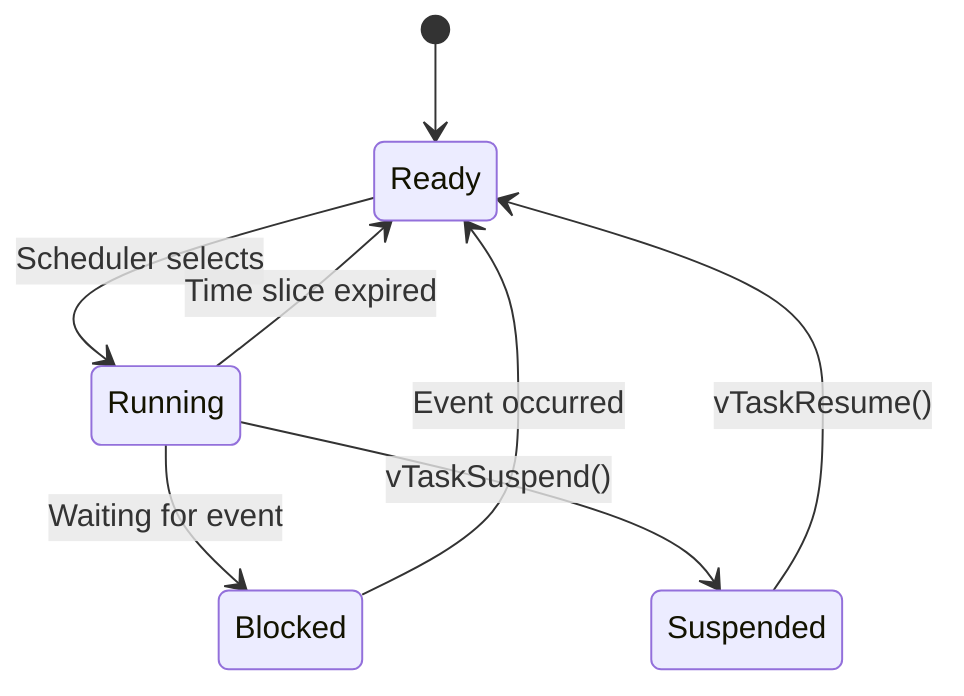

# Создание и управление задачами FreeRTOS

## Теоретические основы

### 1. Основные концепции FreeRTOS

- **Задачи (Tasks)** - независимые потоки выполнения с собственным стеком
- **Планировщик (Scheduler)** - управляет выполнением задач по приоритетам
- **Состояния задач**:
    - **Running**: Выполняется в текущий момент
    - **Ready**: Готова к выполнению
    - **Blocked**: Ожидает события (таймер, семафор и т.д.)
    - **Suspended**: Приостановлена вручную
    - **Deleted**: Удалена из системы

### Префиксы функций FreeRTOS API

| Префикс | Возвращаемый тип | Описание                                         |
|---------|------------------|--------------------------------------------------|
| `v`     | `void`           | Нет возвращаемого значения                       |
| `x`     | `BaseType_t`     | Статус выполнения (pdPASS/pdFAIL)                |
| `pv`    | `void*`          | Указатель на данные общего назначения            |
| `pc`    | `char*`          | Указатель на строку (C-style)                    |
| `ux`    | `UBaseType_t`    | Беззнаковое целое число (обычно 32-битное)       |
| `c`     | `char`           | Символьное значение (редко используется)         |
| `s`     | `int8_t`         | 8-битное знаковое целое (редко используется)     |
| `us`    | `uint16_t`       | 16-битное беззнаковое целое (редко используется) |

### 2. Создание задачи

Для создания задачи используется функция:

```c
BaseType_t xTaskCreate(
    // Функция задачи
    TaskFunction_t pvTaskCode,    
    // Имя задачи (для отладки)
    const char *pcName,           
    // Размер стека
    configSTACK_DEPTH_TYPE usStackDepth,
    // Параметры для задачи
    void *pvParameters,           
    // Приоритет (0 - самый низкий)
    UBaseType_t uxPriority,       
    // Дескриптор созданной задачи
    TaskHandle_t *pxCreatedTask   
);
```

Возвращает:

- `pdPASS` - задача успешно создана
- `pdFAIL` - ошибка создания (недостаточно памяти)

### 3. Структура функции задачи

Функция задачи должна иметь следующую сигнатуру:

- Всегда имеет сигнатуру `void(void *)`
- Должна периодически отдавать управление (`vTaskDelay`)

Пример постоянной задачи:

```c
[[noreturn]] void taskFunction(void *parameters) {
// 1. Преобразование параметров
MyParams *p = (MyParams*)parameters;

    // 2. Инициализация
    pinMode(p->pin, OUTPUT);
    
    // 3. Основной цикл
    while(true) {
        // Логика задачи
        
        // Освобождение процессора
        vTaskDelay(pdMS_TO_TICKS(100));
    }
}
```

Пример временной задачи:

```c
void task(void *) {
    // код задачи
    
    // Освобождение ресурсов
    vTaskDelete(nullptr);
    
    // Код ниже никогда не будет достигнут
}
```

### 4. Передача параметров

Параметры передаются через указатель void*:
Параметры задачи должны жить дольше, чем стек функции, создавшей задачу

- Можно сделать через static, если задача постоянная

```c
struct TaskParams { 
    int pin, interval;
};

// Создание постоянных параметров
static TaskParams params = { 13, 500 };

// Передача в задачу
xTaskCreate(blinkTask, "Blink", 2048, &params, 1, nullptr);
```

- Если ресурсы для задачи рациональнее хранить вместе с задачей, то следует использовать heap

```c
auto params = new TaskParams{ 13, 500 };

// попытка создать задачу
if (xTaskCreate(blinkTask, "Blink", 2048, params, 1, nullptr) != pdPASS) {
    // Если не удалось создать задачу - освобождаем память для от параметров
    delete params;
} 
```

Внутри задачи:

```cpp
void blinkTask(void *p) {
    auto params = static_cast<TaskParams*>(p);
    // Используем params->pin и params->interval
    
    delete params; // Если параметры были созданы через new
    vTaskDelete(nullptr);
}
```

### 5. Управление задачами

| Функция                       | Описание                   |
|-------------------------------|----------------------------|
| `vTaskDelete(TaskHandle_t)`   | Удаление задачи            |
| `vTaskSuspend(TaskHandle_t)`  | Приостановка задачи        |
| `vTaskResume(TaskHandle_t)`   | Возобновление задачи       |
| `eTaskGetState(TaskHandle_t)` | Получение состояния задачи |
| `pcTaskGetName(TaskHandle_t)` | Получение имени задачи     |

- Если передать nullptr вместо дескриптора, действие выполнится для текущей задачи.

### 6. Жизненный цикл задачи



### 7. Приоритеты задач

- Диапазон: от `0` (низший) до `configMAX_PRIORITIES-1`
- Планировщик всегда выполняет задачу с наивысшим приоритетом
- Задачи с одинаковым приоритетом выполняются по очереди

### 8. Важные практики

- Размер стека: Должен быть достаточным для локальных переменных (Лучше всегда брать с запасом, 4КiB хватает всегда)
- Приостановка: Не приостанавливайте задачи, удерживающие ресурсы
- Безопасность: Проверяйте результат создания задач